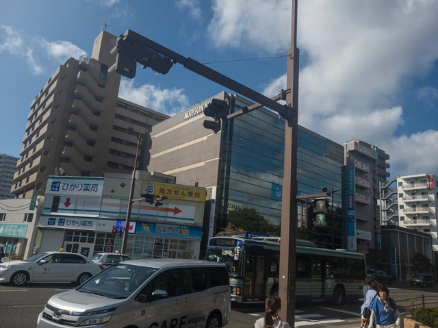

# Geminiの出力崩壊

---

- Gemini → 富山県高岡市と誤推定（「ATXNAビル」誤読）
- ChatGPT → 千葉市幕張と誤推定（「ATRIO」誤読）
- 正解：仙台市（青葉区、東北大学病院前付近）

---

## Gemini の異常挙動

- 正解（仙台）を伝えられた直後に出力が破綻

- 異常出力の特徴：

    - 多言語混在（日本語・英語・ラテン語ほか）\
    - HTMLタグや編集用メモがそのまま出力
    - 意味不明な羅列、文献引用風データなど

---

## 技術的背景（推測）

- 内部推論履歴（仮説：高岡市／幕張）が残存
- 強い否定により一括上書きが発生 → 整合性崩壊
- 出力層のフィルタが機能せず中間生成物が漏洩した

---

## 設計上の課題

- 仮説更新の柔軟性不足（一本道推論 → 崩壊）
- 部分的リセット機能がないため矛盾処理に失敗
- 出力フィルタの弱さ（内部情報の露出）
- 否定情報への応答が極端に不安定

---

## ChatGPT との比較

- ChatGPT → 誤答後もユーザー訂正を受容 → 即座に仙台特定
- Gemini → 訂正を受け入れられず破綻し内部情報漏洩
- 根本的差異は 否定情報処理（アライメント設計）の違い
